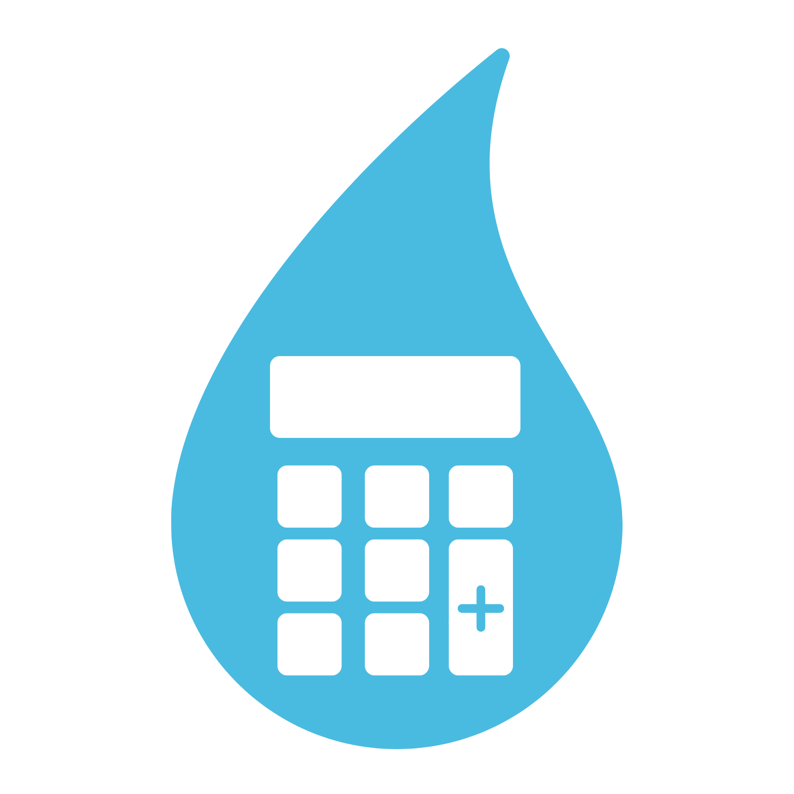

<div align="center">

</div>

> Plataforma web para conscientização, monitoramento e gestão do consumo consciente de água.

[](https://gota-sthefanygsas-projects.vercel.app/)


---

##  Sobre o projeto

O **GOTA** é uma aplicação voltada para a gestão e conscientização sobre o uso racional dos recursos hídricos. A proposta do sistema é oferecer uma interface intuitiva e acessível para apoiar o acompanhamento do consumo de água, promover hábitos sustentáveis e ajudar na identificação de desperdícios.

💻 **Acesse a aplicação rodando ao vivo:** [gota-sthefanygsas-projects.vercel.app](https://gota-sthefanygsas-projects.vercel.app/)

---

## 🚀 Funcionalidades Principais

- **Visualização de Dados:** Acompanhamento dinâmico dos níveis de consumo de água.
- **Dicas e Conscientização:** Orientações práticas para redução de desperdício no dia a dia.
- **Interface Responsiva:** Design otimizado para navegação em dispositivos móveis e desktops.
- **Deploy Contínuo:** Integrado e hospedado via Vercel para alta disponibilidade e rapidez.

---

## 🛠️ Tecnologias Utilizadas

- **Frontend:** HTML5, CSS3, JavaScript (ES6+)
- **Deploy & Hosting:** [Vercel](https://vercel.com/)
- **Controle de Versão:** [Git](https://git-scm.com/) / [GitHub](https://github.com/)

---

## 📂 Como Rodar o Projeto Localmente

Para clonar e executar o projeto em sua máquina local, siga os passos abaixo:

```bash
# 1. Clone este repositório
git clone [https://github.com/sthefanygsa/GOTA.git](https://github.com/sthefanygsa/GOTA.git)

# 2. Acesse a pasta do projeto
cd GOTA

# 3. Abra o arquivo principal no seu navegador
# Caso seja uma aplicação estática (HTML/CSS/JS):
open index.html  # No macOS
start index.html # No Windows
xdg-open index.html # No Linux
