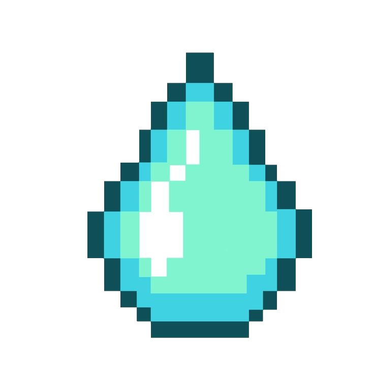
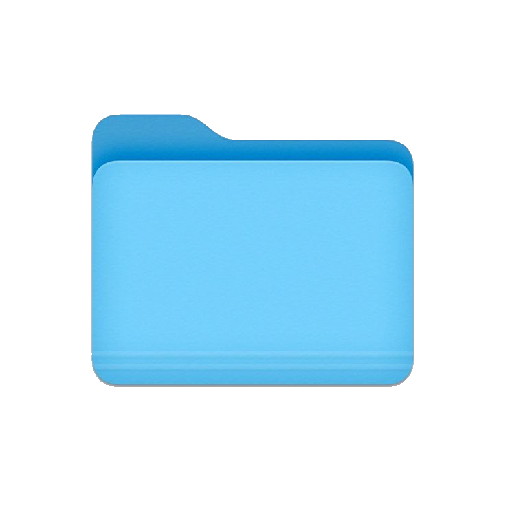

<div align="center">

</div>

<div align="center">
Simulador de Faturamento de Água e Esgoto da Sabesp.
</div>
<br>

<p align="center">
  <a href="#-status-do-projeto">
    
  </a>
</p>

---

##  PROJETO

**EM DESENVOLVIMENTO**: A aplicação já possui funcionalidades operacionais de simulação de tarifas, mas novas ferramentas e cálculos avançados estão sendo desenvolvidos e serão integrados em breve.

O **GOTA** é uma ferramenta desenvolvida para facilitar a compreensão, o controle e a auditoria do consumo de água. 

**Acesse:** [gota-sthefanygsas-projects.vercel.app](https://gota-sthefanygsas-projects.vercel.app/)

---

##  TECNOLOGIAS

- **Frontend:** HTML5, CSS3, JavaScript (ES6+)
- **Deploy & Hosting:** [Vercel](https://vercel.com/)
- **Controle de Versão:** [Git](https://git-scm.com/) / [GitHub](https://github.com/)

---

##  LOCAL

Para clonar e executar o projeto em sua máquina local, siga os passos abaixo:

```bash
# 1. Clone este repositório
git clone [https://github.com/sthefanygsa/GOTA.git](https://github.com/sthefanygsa/GOTA.git)

# 2. Acesse a pasta do projeto
cd GOTA

# 3. Abra o arquivo principal no seu navegador
# Caso seja uma aplicação estática (HTML/CSS/JS):
open index.html  # No macOS
start index.html # No Windows
xdg-open index.html # No Linux
```
---
### Sthefany Alves ✦  

